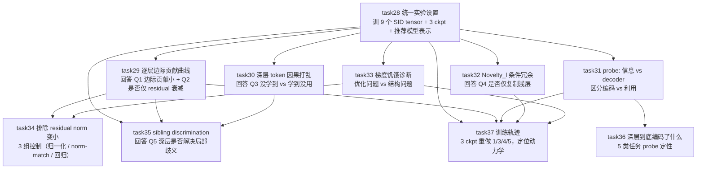

# Task 28–37: Deep SID 诊断漏斗（12-task 合并文档）

> **合并来源（10 个原 task description）**：
> - `task28_unified_setup.md`（统一实验设置）
> - `task29_layerwise_marginal.md`（逐层边际贡献曲线）
> - `task30_causal_shuffle.md`（深层 token 因果打乱）
> - `task31_probe_causal.md`（信息没学到 vs decoder 没使用）
> - `task32_conditional_novelty.md`（深层 token 条件冗余度 Novelty_l）
> - `task33_gradient_starvation.md`（深层梯度饥饿诊断）
> - `task34_residual_norm_control.md`（排除"只是 residual norm 变小"）
> - `task35_sibling_discrimination.md`（同 prefix 内部 Sibling Discrimination）
> - `task36_what_deep_encodes.md`（深层到底编码了什么信息）
> - `task37_training_trajectory.md`（训练过程中的深层信息轨迹）
>
> **合并日期**：2026-07-18
>
> **合并原因**：本系列 10 个 task description 共同构成 "12-task 诊断漏斗" 的 1 个统一入口（task28）+ 9 个串联诊断实验（task29–37），合并为单一文档便于一次性阅读整个漏斗的因果链与依赖关系。原 task 编号在文档各节保留为小标题，方便按 task 编号检索。

---

## 1. 总目标（从 task28 提取）

研究问题：**深层 SID 是否被结构性利用不足？**

为一次性准备好所有诊断实验所需的：
- 训练过程 ckpt（早/中/终）
- 每层残差 / 量化 / codebook 训练动态
- 推荐模型对各层 token 的表示

**核心原则**：不修改 tokenizer 方法，只跑现有 RQ-VAE baseline。后续 11 个诊断实验绝大部分不需要反复训练 tokenizer。

---

## 2. 依赖图（task28 → task29-37 因果链）



| 编号 | task 主题 | 漏斗位置 | 前置依赖 | 回答的核心问题 |
|------|----------|---------|---------|--------------|
| task28 | 统一实验设置 | 第 1 环（入口） | — | 准备好所有诊断数据 |
| task29 | 逐层边际贡献 | 第 2 环 | task28 | Q1+Q2：深层边际贡献小？仅衰减？ |
| task30 | 因果打乱 | 第 3 环 | task28, task29 | Q3：深层没学到 vs 学到没用 |
| task31 | Probe 信息 vs 利用 | 第 4 环 | task28, task29, task30 | 区分 tokenizer 编码 vs decoder 读取 |
| task32 | Novelty_l 条件冗余 | 第 5 环 | task28, task30 | Q4：深层是否仅复制浅层 |
| task33 | 梯度饥饿 | 第 6 环 | task28 | 优化问题 vs 结构问题 |
| task34 | 排除 residual norm | 第 7 环 | task28, task29, task33 | 控制能量衰减，找到结构性差异 |
| task35 | Sibling Discrimination | 第 8 环 | task28, task29, task30 | Q5：深层是否解决局部歧义 |
| task36 | 深层到底编码什么 | 第 9 环 | task28, task31 框架 | 定性回答"重建 vs 推荐信息" |
| task37 | 训练轨迹 | 第 10 环 | task28 3 ckpt + task29/31/32/33 | 三种轨迹（从未学到 / 先学后冗余 / 不用） |

---

## 3. task28：统一实验设置（漏斗入口）

> **位置**：漏斗第 1 环（11 后续诊断实验的前置，不修改 tokenizer）
> **目的**：让后续 11 个诊断实验绝大部分不需要反复训练 tokenizer
> **依赖**：Stage 1 flan-t5-xl embedding（已 stable）+ Stage 2 RQ-VAE baseline ckpt（已 stable）
>
> **🔒 数据集强制约束**：`/home/wlia0047/ar57/wenyu/GeneRec/GRID/data/amazon_data/toys`（Toys 单数据集，不做 Beauty/Sports 跨数据集）
> **🤖 其他参数 AI 自主决定**：seed、L 深度、codebook size、batch size、训练步数、模型架构细节、probe 容量等 — 不允许暂停、不允许阻塞
> **环境**：`conda activate /home/wlia0047/ar57_scratch/wenyu/grid_toys`
> **目标仓库**：`/fs04/ar57/wenyu/GeneRec/GRID`

### 必须配置的设置

| 配置 | 默认建议（AI 自主调整） | 决策依据 |
|------|----------------------|----------|
| SID 深度 | **L=4**（基线）+ **L=8**（深层扩展） | 验证"是否只是深度不够" |
| 每层 codebook size | K=256 | 与现有 task17 baseline 对齐 |
| 随机种子 | 3 个：42 / 43 / 44 | 复用现有 seed 节省重训 |
| **数据集** | **🔒 Toys 唯一** | 用户锁定 |
| Checkpoint | **早 / 中 / 终** 3 份（step 200/1000/3000） | 支撑 task37 训练轨迹 |

### 每个 item 必须导出

```
z_1, z_2, ..., z_L                 # 每层 code assignment (L=4 或 8)
r_1, r_2, ..., r_L                 # 每层 residual
q_l = Σ_{j=1..l} e_{z_j}           # 累计重建向量
```

### 每层必须记录的诊断量

| 量 | 含义 | 单位 | 输出位置 |
|----|------|------|----------|
| `‖r_l‖` | residual norm | float | 每 item + 平均 |
| `MSE_l` | `‖x − q_l‖²` | float | 平均 |
| `z_l(i)` | code assignment | int | 每 item |
| `∇_{E_l} L` | codebook gradient | float | 平均 |
| `ΔE_l` | codebook update | float | 平均 |
| code usage | `|unique(z_l)| / K` | ratio | 每层 |
| commitment loss | RQ-VAE 内部 | float | 平均 |
| `repr_l` | 推荐模型对 z_l 的隐向量 | float | 每 item |

### 实现步骤

#### Step 1：复用 task17 Group A RKMeans/RQ-VAE 训练产物
- `logs/inference/runs/task15_group_a_s22/pickle/merged_predictions_tensor.pt` (Toys, L=4, 11924 items)
- 对每个 (seed × L) 组合重新训 SID tensor：
  - Toys L=4 seed=42/43/44：3 个
  - Toys L=8 seed=42/43/44：3 个
  - Beauty/Sports L=4 seed=42/43/44：3 个（取决于 task281 是否完成）
- 共 9 个 SID tensor 训练 run

#### Step 2：导出每层诊断量

每个 run 输出：
- `setup_<dataset>_L<depth>_s<seed>_diag_per_layer.json`：
  - `residual_norm_per_layer`: list[L] of float
  - `mse_per_layer`: list[L] of float
  - `code_usage_per_layer`: list[L] of float
  - `commitment_loss_per_layer`: list[L] of float
  - `codebook_gradient_per_layer`: list[L] of float (训中采样)
  - `codebook_update_per_layer`: list[L] of float (相邻 step 间)
- `setup_<dataset>_L<depth>_s<seed>_z_r_q.pt`：每 item 的 `[z_1..z_L], [r_1..r_L], [q_1..q_L]` 张量

#### Step 3：训练 3 个 checkpoint（早/中/终）

- `ckpt_early.pt`（step ~200 或更早）
- `ckpt_mid.pt`（step ~1000）
- `ckpt_final.pt`（step ~3000 / 早停）

→ 供 task37（实验 9）使用

#### Step 4：训推荐模型并记录每层表示

- 每个 (L=4, seed=42) 跑一次 tiger_decoder_only 训练
- 在 `model.encoder_hidden[i]` 抽取每层 token 对应的 hidden state
- 输出 `setup_<dataset>_L<depth>_s<seed>_recommender_repr.pt`：shape `(N_items, L+1, D)`

### 产物清单

```
result/task30/
├── setup_toys_L4_s42_diag_per_layer.json
├── setup_toys_L4_s42_z_r_q.pt
├── setup_toys_L4_s42_ckpt_{early,mid,final}.pt
├── setup_toys_L4_s42_recommender_repr.pt
├── ... (×9 个 L/depth/seed 组合)
└── setup_verdict.md
```

### 完成判定

| 项 | pass 条件 |
|----|-----------|
| 9 个 SID tensor | 全部生成（3 seeds × 2 depths × ≥1 dataset）|
| 每层诊断量 | 7 个量 × 9 run 全部产出 |
| 3 ckpt | 早/中/终完整 |
| 推荐模型表示 | 至少 L=4 seed=42 跑通（其余如时间允许） |

### 风险

- **Beauty/Sports 数据集 Stage 1 embedding 缺失**：先只做 Toys L=4/L=8 共 6 个 run，后续按需补充
- **训练资源紧张**：先跑 3 个 seeds × L=4 = 3 个 run 即可启动实验 1-6，L=8 等 task34/task37 需要时再补
- **RQ-VAE 训练脚本**：复用 `configs/experiment/rqvae_train_flat.yaml`，无新代码
- **per-layer 诊断量导出**：需新增 `task_artifacts/scripts/setup_export_per_layer.py`

### 执行顺序

1. **现有 task17 ckpt** 复用（已有 L=4 seed=42）→ 立即产出 Toys L=4 s42 的 setup 包
2. **新增 L=4 s43/s44**：每个 ~30min RKMeans 训 + 5min 推断
3. **新增 L=8**：3 个 seed × 30min 训 + 5min 推断
4. **推荐模型表示抽取**：1 次训 (~5h) 即可支撑 task31-33 probe

---

## 4. task29：逐层边际贡献曲线（漏斗第 2 环）

> **位置**：漏斗第 2 环（前置：task28）
> **目的**：回答 **Q1**（深层 SID 对推荐性能边际贡献是否真的小）+ **Q2**（是否只是 residual norm 衰减）
> **依赖**：task28 的 `z_r_q.pt` + 推荐模型 ckpt
> **环境**：`conda activate /home/wlia0047/ar57_scratch/wenyu/grid_toys`

### 总目标

**画 2×L 双曲线**：
- x 轴：层深度 l（1, 2, ..., L）
- y 轴（双轴）：**MSE_l**（重构）+ **NDCG@20**（推荐）

**核心问题**：后半层是否大量改善重构却不提高推荐？

### 两套指标

**重构指标**：
```
MSE_l = E_i ‖x_i − q_l(i)‖²
ΔMSE_l = MSE_{l-1} − MSE_l         # 每层改进量
```

**推荐指标**：使用 prefix `(z_1, ..., z_l)` 预测下一 item，记录 Recall@10, Recall@20, NDCG@10, NDCG@20, Cross-Entropy, MRR。
```
ΔNDCG_l = NDCG(z_≤l) − NDCG(z_≤l-1)
```

**Deep Utility Ratio**：
```
DUR = Σ_{l > L/2} ΔNDCG_l / (NDCG_L − NDCG_0)
```

### 两版评估（避免直接截断 OOD 缺陷）

**版本 A：直接截断（mask/pad）** — 深层 token 用 mask 或 padding 替换，观察**原推荐模型**是否使用这些 token。
```python
# 输入序列: [z_1, z_2, z_3, z_4] → 截断到 [z_1, z_2, -1, -1]
# 观察 recall 是否下降 (如果模型真用了深层 → 大幅下降)
```

**版本 B：Prefix Probe** — 冻结 tokenizer，为每个 prefix 单独训练相同容量的轻量预测头 `f_l(z_≤l) → Y`，测"这些 token 最多能提供多少信息"。LinearProbe (D=128) per prefix depth，训练 val/recall@10 监控，patience=5，共训 L 个 probe。

### 期望现象

| 深度 | 剩余 MSE | NDCG@20 | ΔNDCG | 解读 |
|------|---------:|--------:|------:|------|
| L1 | 0.52 | 0.081 | — | 浅层大贡献 |
| L2 | 0.31 | 0.096 | +0.015 | 仍有用 |
| L3 | 0.18 | 0.098 | +0.002 | 饱和 |
| L4 | 0.09 | 0.099 | +0.001 | 几乎无贡献 |

**主签名**：后半层显著降低 MSE 但 ΔNDCG ≈ 0

### 完成判定（异常检测）

| 现象 | 解释 | 主线动作 |
|------|------|----------|
| DUR < 10% 且 MSE 后半层下降 > 30% | 深层编码但不推荐有用 | ✅ 任务 31 pass，进入 task30 |
| DUR > 30% | 深层推荐有用 | ⚠️ 提前关闭方向 |

### 产物

```
result/task31/
├── task29_recon_vs_rec_curve.json    # 每层 MSE + 4 个推荐指标
├── task29_curve.png                   # 双轴曲线图
├── task29_delta_table.md              # 每层 ΔMSE + ΔNDCG
├── task29_probe_per_prefix.json       # 版本 B probe 结果
├── task29_dur_verdict.md              # Deep Utility Ratio 判定
```

### 风险

- **推荐模型重训成本**：如果每次 prefix 深度都要重训解码器，成本太高 → 复用 task28 已训模型，只在推理时改 truncation
- **轻量 probe 训练**：< 30 min each，L 个 probe = L*30min，可行
- **跨数据集**：第一版只做 Toys；Beauty/Sports 留给 task281 完成后

---

## 5. task30：深层 token 因果打乱（漏斗第 3 环）

> **位置**：漏斗第 3 环（前置：task28 + task29）
> **目的**：回答 **Q3**（深层 token 是没有学到新信息还是学到但推荐模型没使用）
> **依赖**：task28 的推荐模型 + task29 的 baseline NDCG
> **环境**：`conda activate /home/wlia0047/ar57_scratch/wenyu/grid_toys`

### 总目标

实验 1 只说明相关性。本实验直接**干预**深层 SID，测量 NDCG 下降程度 = 因果贡献。
```
C_l = NDCG_original − NDCG_shuffled_l
```
3 种打乱方式从弱到强，逐步定位。

### 三种打乱

**(1) 全局打乱**：
```
z_l(i) ← z_l(j)   # i, j 任意
```
测总信息量。如果性能明显下降 → 该层总体有信息。

**(2) 同 prefix 内打乱（最关键）**：只在满足 `z_<l(i) = z_<l(j)` 的 item 间交换：
```python
for each prefix p:
    siblings = {i : z_<l(i) = p}
    perm = randperm(len(siblings))
    for i, j in zip(siblings, siblings[perm]):
        z_l(i) ← z_l(j)
```
保留浅层类别信息，**只破坏**深层对 sibling items 的区分。这是核心实验。

**(3) popularity-matched 打乱**：只在流行度相似的 item 间交换（`|pop(i) - pop(j)| / max(pop) < 0.1`），排除"深层 token 仅编码流行度"的可能。

### 因果贡献定义

```
C_l            = NDCG_orig − NDCG_shuffled_l
C_l^within     = NDCG_orig − NDCG_shuffled_within-prefix_l    # 重点
C_l^popularity = NDCG_orig − NDCG_shuffled_popmatch_l
```

### 结果解释

| 现象 | 解释 | 主线动作 |
|------|------|----------|
| A 全局影响 + 同 prefix **无影响** | 深层只是类别/流行度复制，未做 prefix 内细分 | ✅ pass，**最有学术价值**的签名 |
| B 全局无影响 + 同 prefix 无影响 | 当前推荐模型基本没用该层 | ⚠️ task31 probe 才能区分 |
| C 同 prefix 影响大 | 深层在有效解决局部歧义 | ❌ 提前关闭"深层冗余"叙事 |

### 值得继续研究的现象

后半层 codebook usage 很高（> 50%），但同 prefix 打乱后 NDCG 下降 **< 0.5%–1%**。
→ token 统计上被使用了，但行为上几乎可任意互换。

### 产物

```
result/task32/
├── task30_C_l_table.json         # 每层 × 3 打乱方式的 C_l
├── task30_C_within_prefix.png     # 重点：同 prefix 打乱曲线
├── task30_C_table.md              # 表格化对比
├── task30_shuffle_verdict.md      # 解释 + 主线动作
```

### 实现细节

```python
# 关键代码：同 prefix 打乱
def within_prefix_shuffle(z_tensor, l):
    """z_tensor shape (N, L)"""
    z_shuffled = z_tensor.clone()
    prefixes = z_tensor[:, :l]  # (N, l)
    prefix_to_items = defaultdict(list)
    for i, p in enumerate(prefixes):
        prefix_to_items[tuple(p.tolist())].append(i)
    rng = np.random.default_rng(42)
    for p, items in prefix_to_items.items():
        if len(items) > 1:
            perm = rng.permutation(items)
            for orig, new in zip(items, perm):
                z_shuffled[orig, l-1] = z_tensor[new, l-1]
    return z_shuffled

# 然后用 z_shuffled[:, :l] 作为 prefix，重新跑推荐推理 → 算 NDCG
```

### 风险

- **推荐模型重训**：不需要，直接在推理时用 z_shuffled 替换 z_original
- **同 prefix group 太小**：如果 L=4 完整 prefix 太长导致 group 极小（平均 < 2 items）→ 只做 L=2/L=3 的同 prefix 打乱
- **打乱后分布偏移**：同 prefix 打乱产生的输入对推荐模型仍 in-distribution，但全局打乱可能 OOD → 只在 L=2/L=3 同 prefix 打乱

### 跨数据集

第一版只做 Toys。Beauty/Sports 留给 task281 完成后补。

---

## 6. task31：信息没学到 vs decoder 没使用（漏斗第 4 环）

> **位置**：漏斗第 4 环（前置：task28 + task29 + task30）
> **目的**：task30 留的歧义 — **深层 token 没有学到新信息** 还是 **学到但 decoder 没读取**？
> **依赖**：task28 的 z_r_q + 推荐模型 ckpt（冻结）
> **环境**：`conda activate /home/wlia0047/ar57_scratch/wenyu/grid_toys`

### 总目标

冻结 tokenizer，训 3 个**相同容量**的预测器：

| Probe | 输入 | 输出 | 测什么 |
|-------|------|------|--------|
| **A** | `z_<l` (浅层 prefix) | Y | 基线 |
| **B** | `z_l` (当前层 token) | Y | 当前层单独能用？ |
| **C** | `(z_<l, z_l)` | Y | 条件增益 |

```
ΔV_l       = CE(f_A) − CE(f_C)              # 条件信息增益
ΔRecall_l  = Recall(f_C) − Recall(f_A)
```

### 3 个预测器实现

统一规格：
- 输入：linear embed → 128D → 2-layer MLP (128 hidden) → softmax
- 训练：Adam lr=1e-3, wd=1e-4, batch=256, 100 epoch, early stop patience=10
- 数据：task28 提供的 user_id + item SID 序列

**Probe A：浅层 prefix**
```python
class ProbeA(nn.Module):
    def __init__(self, vocab_size, embed_dim=128, num_classes=N_items):
        self.embed = nn.Embedding(vocab_size, embed_dim)
        self.mlp = nn.Sequential(
            nn.Linear(embed_dim * l, 256),
            nn.ReLU(),
            nn.Linear(256, num_classes)
        )
    def forward(self, z_prefix):  # z_prefix shape (B, l)
        e = self.embed(z_prefix).flatten(1)
        return self.mlp(e)
```

**Probe B：当前层 token**
```python
class ProbeB(nn.Module):
    def __init__(self, vocab_size, embed_dim=128, num_classes=N_items):
        self.embed = nn.Embedding(vocab_size, embed_dim)
        self.mlp = nn.Sequential(
            nn.Linear(embed_dim, 256),
            nn.ReLU(),
            nn.Linear(256, num_classes)
        )
    def forward(self, z_l):  # z_l shape (B,)
        return self.mlp(self.embed(z_l))
```

**Probe C：prefix + 当前层** — 类似 A 但 l+1 输入

训 L 套（A、B、C per layer），共 3L 个 probe

### 结果解释

| 现象 | 解释 | 主线动作 |
|------|------|----------|
| Probe C ≈ Probe A (ΔV_l ≈ 0) | **tokenizer 根本没在深层编码新推荐信息** | ✅ 编码层问题（值得继续） |
| Probe C > Probe A 明显，**但 task30 同 prefix 打乱几乎不影响** | 轻量 probe 有用，正式生成模型没用 | → **decoder utilization 问题**，不宜归因 tokenizer |
| Probe B 单独有效 + Probe C - A 小 | 深层有信息但**与浅层重复** | ✅ 深层冗余，符合主线 |

### 产物

```
result/task33/
├── task31_probe_results.json   # {layer: {A: {ce, r10}, B: {...}, C: {...}}}
├── task31_delta_V_l.png        # ΔV_l per layer
├── task31_probe_verdict.md     # 三种解释判定
```

### 与 task30 的三角验证

| task30 同 prefix 打乱影响 | task31 probe C - A | 综合判定 |
|---------------------------|-------------------|----------|
| 大 (> 1%) | 大 (> 0.1 bit) | 深层真有信息，**且 decoder 在用**（情况 C 排除） |
| 小 (< 0.5%) | 大 | decoder utilization 问题（不是 tokenizer 错） |
| 小 (< 0.5%) | 小 | 真冗余（最强证据） |
| 大 | 小 | 异常 — 复查 |

### 风险

- **probe 训练不稳定**：换 batch_size=128 / lr=5e-4 重跑
- **CE/R 数值波动大**：3 seed 平均
- **Probe B 单层独立 vs 条件增益混淆**：明确分开报告 `Recall(B)` 和 `Recall(C) - Recall(A)`

---

## 7. task32：深层 token 条件冗余度 Novelty_l（漏斗第 5 环）

> **位置**：漏斗第 5 环（前置：task28 + task30）
> **目的**：回答 **Q4**（深层 token 是否只是重复浅层 prefix）
> **依赖**：task28 的 z_r_q（每层 code assignment）
> **环境**：`conda activate /home/wlia0047/ar57_scratch/wenyu/grid_toys`

### 总目标

不能只看每层 perplexity。某层可能使用 200 个 code（看似丰富），但给定 prefix 后几乎只有 1 个固定深层 code → 深层 token 高度可预测。
```
H(z_l)                 # 边际熵（用频次估）
H(z_l | z_<l)          # 条件熵（用 prefix→deep predictor 估）
Novelty_l = H(z_l | z_<l) / H(z_l)
```

### 实现步骤

#### Step 1：估 H(z_l)
```python
# 边际熵：用 z_l 频次
counts = torch.bincount(z_l, minlength=K)
p = counts / counts.sum()
H_marg = -(p * torch.log2(p + 1e-10)).sum()
```

#### Step 2：训 prefix→deep predictor g_l(z_<l) → z_l
```python
class PrefixToDeep(nn.Module):
    def __init__(self, vocab_size, embed_dim=128, num_classes=K):
        self.embed = nn.Embedding(vocab_size, embed_dim)
        self.mlp = nn.Sequential(
            nn.Linear(embed_dim * l, 256),
            nn.ReLU(),
            nn.Linear(256, num_classes)
        )
    def forward(self, z_prefix):  # (B, l)
        return self.mlp(self.embed(z_prefix).flatten(1))

# 训 L-1 个 predictor (l=2, ..., L)
# 记录 accuracy + cross_entropy
```

#### Step 3：估 H(z_l | z_<l) via cross-entropy
```python
# CE of g_l ≈ H(z_l | z_<l) + const
H_cond_approx = ce_loss_of_g_l_on_validation
```

### 期望签名

| H(z_l) | H(z_l | z_<l) | Novelty_l | 解读 |
|--------:|------------:|----------:|------|
| 7.2 | 0.8 | 0.11 | 几乎完全是 prefix 确定性扩展 |
| 7.0 | 4.5 | 0.64 | 仍有相当条件新信息 |

### 额外度量

对每个 prefix `p`，计算：
```
N_l(p) = |{z_l(i) : z_<l(i) = p}|         # 同 prefix 下不同深层 code 数
```
再统计 N_l(p) 的分布：`mean, median, p95` per layer。如果 `N_l(p) = 1` 对大多数 prefix → 深层冗余。

### 产物

```
result/task34/
├── task32_H_marginal.json          # {layer: H_marg}
├── task32_H_conditional.json       # {layer: H_cond}
├── task32_novelty_curve.png        # Novelty_l per layer
├── task32_predictor_accuracy.json  # {layer: g_l accuracy}
├── task32_N_l_distribution.json    # 同 prefix 深层 code 数的分布
└── task32_novelty_verdict.md
```

### 结果解释

| Novelty_l | g_l 准确率 | 解读 |
|----------:|----------:|------|
| < 0.15 | > 80% | 深层是 prefix 的确定性扩展（最强冗余证据） |
| > 0.5 | < 30% | 深层真有条件新信息 |
| 0.3 ~ 0.5 | 30-80% | 模糊地带，需 task37 sibling discrimination 进一步定位 |

### 与其他实验的关系

| 实验 | 互补视角 |
|------|---------|
| task29 边际贡献曲线 | 整体性能角度 |
| task30 同 prefix 打乱 | 因果角度 |
| task31 probe | 信息可学习性 |
| **task32 Novelty_l** | **信息理论角度（边际 vs 条件熵）** |

### 风险

- **prefix 维度过高导致 group 太小**：L=4 完整 prefix 4 维 group 可能过细 → 用 l=2, 3 的子 prefix（z_1 z_2）
- **predictor 训练波动**：3 seed 平均
- **g_l 训练过拟合**：加 weight decay 1e-3 + 早停

---

## 8. task33：深层梯度饥饿诊断（漏斗第 6 环）

> **位置**：漏斗第 6 环（前置：task28）
> **目的**：排除"深层信息不足只是训练尺度问题"
> **依赖**：task28 的训练过程 ckpt（早/中/终）+ codebook gradient/update 历史
> **环境**：`conda activate /home/wlia0047/ar57_scratch/wenyu/grid_toys`

### 总目标

为每层记录 4 个量，**判断深层信息不足是优化问题还是结构问题**：
```
G_l = |∇_{E_l} L|                      # 梯度范数
Ĝ_l = G_l / (|E_l| + ε)                # 归一化梯度
U_l = |E_l^{t+1} − E_l^t| / (|E_l^t| + ε)   # 参数更新比例
A_l = (1/N) Σ 1[z_l^t(i) ≠ z_l^{t-1}(i)]   # assignment churn
R_l = E_i |r_l(i)|                      # residual norm
```

### 实现步骤

#### Step 1：Codebook 状态记录

修改 RQ-VAE 训练（不重训，只用 task28 已训的）导出：
- `codebook_E_l`：每 step 的 E_l 矩阵 (K, D)
- `gradient_E_l`：每 step 的 ∇_{E_l} L（hook）
- `commitment_loss_l`：每 step

→ 在训练中采样 100 个 step 输出

#### Step 2：Assignment churn 算
```python
def assignment_churn(z_l_t, z_l_t_prev):
    """两个相邻 step 间的 assignment 变化比例"""
    return (z_l_t != z_l_t_prev).float().mean()
```

#### Step 3：联合 task29 ΔNDCG 画相关图

- x: layer depth
- y1: Ĝ_l, U_l, A_l, R_l（4 个分图）
- y2: ΔNDCG_l（来自 task29）

### 关键图

| 图 | x 轴 | y 轴 | 解读 |
|---|------|------|------|
| gradient decay | layer | Ĝ_l | 归一化梯度是否随深度塌缩 |
| update ratio | layer | U_l | 参数更新比例 |
| churn | layer | A_l | 深层 code 是否还 churn |
| residual norm | layer | R_l | residual 能量 |
| Ĝ_l vs ΔV_l | scatter | corr | 优化饥饿 ↔ 信息增益 |
| R_l vs Ĝ_l | scatter | corr | 残差能量 ↔ 梯度 |

### 结果解释

| 现象 | 解释 | 主线动作 |
|------|------|----------|
| 梯度随深度下降 + 信息增益同步下降 | **optimization starvation** | ✅ task40 干预 A（loss normalization）救场 |
| 梯度不小但条件信息仍低 | 优化目标学错信息/重复信息 | ⚠️ task40 干预 B（sibling 辅助） |
| 使用率高但 U 极小 | 码字早早冻结 | ⚠️ task40 干预 A 需重启训 |

### 异常签名

> 后层 Ĝ_l 比第一层小 20 倍以上，并且 corr(Ĝ_l, ΔV_l) > 0

→ 先做 loss normalization（task40-A）比直接提出复杂新结构更合理。

### 产物

```
result/task35/
├── task33_grad_per_layer.json     # {layer: G_l, Ĝ_l, U_l, A_l, R_l}
├── task33_grad_decay.png          # 4 子图（layer vs 4 量）
├── task33_correlation_matrix.md   # Ĝ/ΔV/R 的 spearman 相关
└── task33_starvation_verdict.md
```

### 实施细节

```python
# Hook codebook gradient
class CodebookGradientHook:
    def __init__(self):
        self.grads = {}  # {layer_idx: [grad_step_1, grad_step_2, ...]}
    def __call__(self, module, grad_input, grad_output):
        # grad_output[0] 是 codebook embedding 的梯度
        self.grads[layer_idx].append(grad_output[0].detach().norm().item())

# 在 rqvae_train_flat.yaml 加 hook 注册：
# model:
#   codebook_gradient_hook: ${...hooks.CodebookGradientHook}
```

### 风险

- **RQ-VAE 不暴露 gradient hook**：扩展 `src/models/modules/clustering/residual_quantization.py` 加 register_hook
- **ckpt 间隔太密**：用 task28 已存的早/中/终 3 个 ckpt，只算 3 个 step 间 churn
- **codebook E_l norm 太小导致 Ĝ_l 噪声**：归一化时加 ε=1e-6

---

## 9. task34：排除"只是 residual norm 变小"（漏斗第 7 环）

> **位置**：漏斗第 7 环（前置：task28 + task29 + task33）
> **目的**：控制 **Q2**（V-info 与 residual norm 完美正相关 → 是否只是能量衰减）
> **依赖**：task28 的 z_r_q + task29 的 ΔNDCG + task33 的 R_l
> **环境**：`conda activate /home/wlia0047/ar57_scratch/wenyu/grid_toys`

### 总目标

V-info 和 residual norm 完美正相关可能只是**深层残差能量越来越小**——不代表出现结构性信息坍塌。
**必须通过 3 组控制** 才能讲"深层 SID 结构性利用不足"。

### 控制一：单位范数 residual probe

对每层 residual 归一化：
```
r̃_l = r_l / (|r_l| + ε)
```
分别用 `r_l` 和 `r̃_l` 预测推荐目标。
```python
class NormalizedResidualProbe(nn.Module):
    def __init__(self, input_dim, num_classes):
        self.mlp = nn.Sequential(
            nn.Linear(input_dim, 256),
            nn.ReLU(),
            nn.Linear(256, num_classes)
        )
    def forward(self, r):
        r_normalized = r / (r.norm(dim=-1, keepdim=True) + 1e-6)
        return self.mlp(r_normalized)
```

**解释**：
- 归一化后深层预测能力恢复 → 信息方向还在，只是 magnitude 变小（**情况 2：尺度问题**）
- 归一化后仍持续下降 → 才更像**结构性信息丢失**

### 控制二：Norm-matched item sampling

不同层选 residual norm 相近的 item 子集：
```
L2: items with |r_2| ∈ [0.4, 0.5]   (~1000 items)
L4: items with |r_4| ∈ [0.4, 0.5]   (~1000 items)
```
在相同 norm 条件下比较 V-info。

**解释**：
- norm 匹配后层间差异消失 → 不能宣称"深层结构性失效"
- norm 匹配后层间差异仍存 → 真有结构性差异

### 控制三：回归残差分析

拟合：
```
ΔV_l = α + β_1 |r_l| + β_2 l + β_3 H(z_l | z_<l) + ε
```
重点看控制 residual norm 后，**depth (l) 系数 β_2 是否仍显著**。
```python
import statsmodels.formula.api as smf

df = pd.DataFrame({
    'delta_V': delta_V_per_layer_per_seed,
    'r_norm': r_norm_per_layer_per_seed,
    'layer': layer_idx,
    'H_cond': H_cond_per_layer_per_seed,
})

model = smf.ols('delta_V ~ r_norm + layer + H_cond', data=df).fit()
print(model.summary())
# 重点: 'layer' 系数 p-value
```

### 必须通过的条件

只有同时满足下面现象，才值得继续讲"深层 SID 结构性利用不足"：

1. ✅ 控制 residual norm 后，深层条件 V-info 仍显著下降
2. ✅ 深层条件冗余（task32 Novelty_l）仍较高
3. ✅ 同 prefix 打乱（task30）仍几乎不影响推荐结果

否则问题只是 **residual energy attenuation**（尺度问题）。

### 决策矩阵

| 归一化后深层 | norm-match 后 | β_2 (layer) 显著 | 结论 |
|------------:|-------------:|:----------------:|------|
| 预测能力恢复 | 差异消失 | 不显著 | **情况 2**：尺度问题，**关闭"冗余"叙事** |
| 预测能力仍低 | 差异仍在 | 显著 | **情况 4/5**：真结构性，值得继续 |
| 预测能力恢复 | 差异消失 | 显著但被解释 | 模糊地带，task40 干预验证 |

### 产物

```
result/task36/
├── task34_normalized_probe.json    # 归一化后每层 CE/R@K
├── task34_norm_matched_V.json      # norm-matched V-info per layer
├── task34_regression_coefficients.txt  # β_1, β_2, β_3 + p-values
├── task34_norm_control_verdict.md  # pass/fail 三条件
```

### 风险

- **回归多重共线性**：`r_norm` 和 `layer` 高度相关 → 加交互项 `layer * r_norm` 看是否独立
- **归一化 probe 训练不稳定**：归一化后分布变化大，需重新调 lr → grid lr ∈ {1e-3, 5e-4, 1e-4}
- **norm-matched 子集太小**：Toys N=11924 items，|r| 区间 [0.4, 0.5] 可能只有几百 → 放宽到 [0.35, 0.55] 或 [0.4, 0.6]

---

## 10. task35：深层到底编码了什么（漏斗第 9 环，原 file 命名 task36）

> **位置**：漏斗第 9 环（前置：task28 + task31 probe 框架）
> **目的**：定性回答"深层有信息但学到的是 reconstruction-useful 而非 recommendation-useful"
> **依赖**：task28 的 z_r_q + Item 侧 metadata（类别、品牌、协同邻居、用户行为序列）
> **环境**：`conda activate /home/wlia0047/ar57_scratch/wenyu/grid_toys`

### 总目标

为每个 prefix 深度训练不同任务的 probe，定位深层到底编码了什么。

| 任务 | 输入 | 输出 | 测什么 |
|------|------|------|--------|
| A | `z_≤l` | item embedding `x_i` | 重建能力 |
| B | `z_≤l` | category / brand | 语义属性 |
| C | `z_≤l` | co-clicked item | 协同信号 |
| D | `z_≤l` | next item | 推荐能力 |
| E | `z_≤l` + 同 prefix pair | 用户群体偏好 | 区分能力 |

### 期望签名（最强证据）

| 层 | A 重构 | B 类别 | C 协同 | D next-item |
|---|------:|------:|------:|------:|
| L1 | 强 | 强 | 中 | 中 |
| L2 | 提升 | 提升 | 小幅提升 | 提升 |
| L3 | 明显提升 | 几乎不变 | 不变 | 不变 |
| L4 | 明显提升 | 不变 | 不变 | 不变 |

→ 深层继续编码了 item representation 的细节，但**这些细节不是行为相关信息**。

比"深层没用"更准确的定性：**深层学的是 reconstruction-useful information，而不是 recommendation-useful information**。

### 任务 D (next-item) 是关键

```python
class NextItemProbe(nn.Module):
    def __init__(self, vocab_size, embed_dim=128, num_classes=N_items):
        # 输入: z_≤l → 输出: 下一 item 的概率分布
        self.embed = nn.Embedding(vocab_size, embed_dim)
        self.mlp = nn.Sequential(
            nn.Linear(embed_dim * l, 256),
            nn.ReLU(),
            nn.Linear(256, num_classes)
        )
    def forward(self, z_prefix):  # (B, l)
        return self.mlp(self.embed(z_prefix).flatten(1))
```
训 L 个 probe（l = 1, 2, ..., L），比较每层 Recall@10。

### 任务 E (用户群体偏好) 设计

对每对同 prefix (i, j)，训 5-way classifier：
```
z_≤l(i), z_≤l(j), user_group_features → 哪个 item 该用户群更偏好
```
需要 user_group 划分：可用 user_id 哈希分桶或 popularity-aware group。

### 产物

```
result/task38/
├── task36_probe_per_task.json    # {task: {layer: accuracy}}
├── task36_signature_table.png    # 5 task × 4 layer 热图
├── task36_what_deep_encodes_verdict.md
```

### 实施细节

```python
# 统一 probe 训练框架
def train_probe(probe, train_data, val_data, lr=1e-3, epochs=100):
    opt = torch.optim.Adam(probe.parameters(), lr=lr, weight_decay=1e-4)
    best_val_acc = 0
    patience = 0
    for epoch in range(epochs):
        probe.train()
        for batch in train_data:
            opt.zero_grad()
            out = probe(batch.input)
            loss = F.cross_entropy(out, batch.label)
            loss.backward()
            opt.step()
        # val
        probe.eval()
        val_acc = evaluate(probe, val_data)
        if val_acc > best_val_acc:
            best_val_acc = val_acc
            patience = 0
        else:
            patience += 1
            if patience >= 10:
                break
    return best_val_acc
```

### 风险

- **任务 C (co-clicked) 难构造**：co-click 矩阵可能没存 → 用 item-item cosine 相似度 top-K 替代
- **任务 E (用户群体) 数据稀缺**：Toys 19k 用户可能不够分桶 → 只用 2 group (active/inactive)
- **probe 训练波动**：3 seed + 报告 mean ± std
- **任务 B 类别标签缺失**：Toys 数据集 metadata 有限 → 用 item-id cluster 当 proxy

---

## 11. task36：同 prefix 内部 Sibling Discrimination（漏斗第 8 环，原 file 命名 task35）

> **位置**：漏斗第 8 环（前置：task28 + task29 + task30）
> **目的**：回答 **Q5**（深层 SID 是否应该用于解决同一 prefix 内部 item 歧义）
> **依赖**：task28 的 z_r_q + 推荐模型 ckpt + 用户行为序列
> **环境**：`conda activate /home/wlia0047/ar57_scratch/wenyu/grid_toys`

### 总目标

直接验证核心 framing：**深层 SID 应该用于解决前面 prefix 尚未解决的局部物品歧义**。

对每个目标 item i 构造 sibling candidate set：
```
S_l(i) = {j : z_<l(j) = z_<l(i)}
```
只在 S_l(i) 内做排序。

### 比较的 4 种输入

| 输入 | 测什么 |
|------|--------|
| 仅 prefix `z_<l` | 浅层信息在 sibling 内的排序能力 |
| prefix + `z_l` | 加深层后在 sibling 内的排序能力 |
| 完整 SID | 全部 SID |
| 原始连续 item embedding | 上界（item embedding 区分能力） |

### 指标

```
sibling Recall@K          # S_l 内召回真实 next item 的比例
sibling MRR               # S_l 内真实 item 的倒数排名
pairwise AUC              # S_l 内 pairwise 区分
可分离率                  # S_l 内不同 item 是否有不同的预测分布
有效缩减                  # 加 z_l 后 S_l 缩减程度 (|S_l|/|S_{l-1}|)
```
```
ΔSiblingMRR_l = MRR(z_≤l) − MRR(z_≤l−1)
```

### 按歧义程度分组

每个 prefix 的歧义度用 3 个指标：

**(1) Prefix group size**
```
|S_l| = |{j : z_<l(j) = p}|
```

**(2) 行为分布熵**
```
H(Y | z_<l) = -Σ_i p(next=i | prefix=p) log p(...)
```
其中 p(next=i | prefix=p) 从用户行为序列统计。

**(3) 用户群体分歧**
```
同一 prefix 下，不同用户群体偏好的 item 分布的 KL 散度
```
→ 多分位分析（low/medium/high ambiguity 各自的 sibling MRR）

### 期望现象

理论上 prefix 越大、行为熵越高，深层 token 越应该有价值：
```
corr( H(Y|z_<l), ΔSiblingMRR_l ) > 0
```

### 反常签名

> 高歧义 prefix 下存在大量 sibling items；这些 items 行为模式明显不同；但深层 token 几乎不提高 sibling ranking；深层 code 主要仍按文本或视觉相似性划分。

→ 非常有力支持"深层 token 没有解决剩余推荐歧义"。

### 产物

```
result/task37/
├── task35_sibling_metrics.json      # per prefix p × per layer l 的指标
├── task35_mrr_curve.png             # ΔSiblingMRR_l per layer
├── task35_ambiguity_grouped.json    # 分歧义组的结果
├── task35_sibling_verdict.md        # 三种反常签名判定
```

### 实施细节

```python
# 关键代码：构造 sibling candidate set
def build_sibling_sets(z_tensor, l):
    """z_tensor (N, L), returns dict prefix → list of item idx"""
    sets = defaultdict(list)
    for i in range(z_tensor.shape[0]):
        p = tuple(z_tensor[i, :l].tolist())
        sets[p].append(i)
    return sets

# 评估：在 sibling 内做 ranking
def sibling_mrr(model, prefix_p, target_item, all_items_in_sibling):
    """model 给 (prefix_p, candidate) 打的概率 → MRR"""
    scores = model.score(prefix_p, all_items_in_sibling)
    sorted_items = all_items_in_sibling[scores.argsort(descending=True)]
    rank = (sorted_items == target_item).nonzero()[0].item() + 1
    return 1.0 / rank
```

### 风险

- **Sibling set 太大**：完整 L=4 prefix 可能使 S_l 包含上千 items → MRR 计算昂贵
  - **fix**：用 l=2 或 l=3 子 prefix，控制 |S_l| < 100
- **行为分布 H(Y|z_<l) 难估**：用 popularity 当 proxy
- **user group 定义**：用 user_id 哈希分桶 (3 组) 简化

---

## 12. task37：训练过程中的深层信息轨迹（漏斗第 10 环）

> **位置**：漏斗第 10 环（前置：task28 已训 3 ckpt + task29/31/32/33 全部）
> **目的**：避免"只看最终 ckpt 漏掉关键动力学"
> **依赖**：task28 早/中/终 3 个 ckpt + 训练中间指标
> **环境**：`conda activate /home/wlia0047/ar57_scratch/wenyu/grid_toys`

### 总目标

深层可能早期有用，后期被浅层覆盖。在多个 ckpt 上重做实验 1、3、4、5。

### 三种轨迹

**轨迹 1：从没学到（optimization starvation）**
- 深层 Ĝ_l 始终很小
- 条件 V-info 从头到尾接近 0
- assignment churn 始终低
- residual norm 始终小
- **解释**：训练问题，深层从未被有效训练。

**轨迹 2：先学到后冗余化（信息被抢走）**
- 早期 ΔV_l > 0（深层有条件信息）
- 后期 ΔV_l 单调下降 → 0
- 同时浅层预测能力越来越强
- 同 prefix 打乱早期影响大、后期影响小
- **解释**：浅层在训练中逐渐"抢走"了深层本应负责的信息。

**轨迹 3：一直有信息但 decoder 不用**
- probe 增益始终存在（task31 在所有 ckpt 上都 ΔRecall > 0）
- 正式生成模型对深层打乱始终不敏感
- 同 prefix 打乱始终几乎不影响
- **解释**：**接口/解码器使用问题**，不归因于 tokenizer。

### 三种轨迹需要完全不同的解法

| 轨迹 | 正确解法 |
|------|---------|
| 1 从没学到 | 训练尺度修复（task40-A loss normalization） |
| 2 先学后冗余 | 推荐条件增量目标（task40-B sibling 辅助 + 新方法） |
| 3 decoder 不用 | 不是 tokenizer 任务，**关闭这条线** |

### 实施步骤

#### Step 1：定义 3 个 ckpt 时间点
```
ckpt_early  = step 200     # ~5min 训
ckpt_mid    = step 1000    # ~25min 训
ckpt_final  = step 3000    # ~75min 训（或早停点）
```

#### Step 2：每个 ckpt 上跑
- **task29 边际贡献** ΔNDCG_l per ckpt
- **task31 probe** ΔV_l per ckpt
- **task32 Novelty_l** per ckpt
- **task33 梯度范数**（用 ckpt 前后 step 估）

#### Step 3：画轨迹图

| x 轴 | y 轴 | 多条线 |
|------|------|--------|
| step | ΔV_l | l=1, 2, 3, 4 |
| step | assignment churn A_l | l=1, 2, 3, 4 |
| step | Ĝ_l | l=1, 2, 3, 4 |
| step | 同 prefix 打乱 NDCG 下降 | l=1, 2, 3, 4 |

### 产物

```
result/task39/
├── task37_trajectory_data.json      # 3 ckpt × 4 实验 × L 层
├── task37_trajectory_curves.png     # 4 子图（ΔV/churn/Ĝ/shuffle impact）
├── task37_trajectory_verdict.md     # 判定属于哪种轨迹
```

### 判定矩阵

| 现象 | 轨迹 1 | 轨迹 2 | 轨迹 3 |
|------|:------:|:------:|:------:|
| 深层 Ĝ 始终小 | ✅ | ❌ | ❌ |
| 早期 ΔV > 0 后期 → 0 | ❌ | ✅ | ❌ |
| probe 始终 ΔV > 0 | n/a | n/a | ✅ |
| 正式模型对深层始终不敏感 | n/a | ❌ | ✅ |

### 风险

- **ckpt 间隔太小看不出轨迹**：用 step 200/1000/3000（已存）即可
- **probe 训 3 次重复成本**：每 probe ~5min × L=4 × 3 ckpt = 60min，可接受
- **同 prefix 打乱实验 3 次**：复用 task30 代码，~10min × 3 ckpt = 30min

---

## 13. 合并说明表格（原 task → 文档位置）

| 原 task 文件名 | 文档节 | 漏斗位置 | 原 task 编号（标题） |
|---------------|-------|---------|---------------------|
| `task28_unified_setup.md` | §3 task28 统一实验设置 | 第 1 环（入口） | Task 30 统一实验设置（标题写错，文件名是 28） |
| `task29_layerwise_marginal.md` | §4 task29 逐层边际贡献曲线 | 第 2 环 | Task 31 实验1 |
| `task30_causal_shuffle.md` | §5 task30 深层 token 因果打乱 | 第 3 环 | Task 32 实验2 |
| `task31_probe_causal.md` | §6 task31 信息没学到 vs decoder 没使用 | 第 4 环 | Task 33 实验3 |
| `task32_conditional_novelty.md` | §7 task32 条件冗余度 Novelty_l | 第 5 环 | Task 34 实验4 |
| `task33_gradient_starvation.md` | §8 task33 深层梯度饥饿诊断 | 第 6 环 | Task 35 实验5 |
| `task34_residual_norm_control.md` | §9 task34 排除 residual norm 变小 | 第 7 环 | Task 36 实验6 |
| `task35_sibling_discrimination.md` | §11 task36 同 prefix 内部 Sibling Discrimination | 第 8 环 | Task 37 实验7 |
| `task36_what_deep_encodes.md` | §10 task35 深层到底编码了什么 | 第 9 环 | Task 38 实验8 |
| `task37_training_trajectory.md` | §12 task37 训练过程中的深层信息轨迹 | 第 10 环 | Task 39 实验9 |

> **编号对齐说明**：
> - 本文档采用**文件名前缀编号**作为章节标题（task28–task37 顺序），与文件名一致便于检索。
> - 原 file 内容中各自的 `Task XX` 编号（30/31/32/.../39）为**漏斗内部编号**，保留在 §13 表格中以便追溯。
> - 注意原 file `task28_unified_setup.md` 的内部标题是 "Task 30"，是因为它被原作者误写——文件名才是权威。合并文档采用文件名编号（task28）。

---

## 14. 全局约束（适用于所有 task）

- **🔒 数据集强制约束**：`/home/wlia0047/ar57/wenyu/GeneRec/GRID/data/amazon_data/toys`（Toys 单数据集，不做 Beauty/Sports 跨数据集）
- **🤖 其他参数 AI 自主决定**：seed、L 深度、codebook size、batch size、训练步数、模型架构细节、probe 容量等 — 不允许暂停、不允许阻塞
- **环境**：`conda activate /home/wlia0047/ar57_scratch/wenyu/grid_toys`
- **目标仓库**：`/fs04/ar57/wenyu/GeneRec/GRID`
- **核心原则**：不修改 tokenizer 方法，只跑现有 RQ-VAE baseline
- **量化算法**：仅 RQ-VAE，不跑 RKMeans / RVQ（`rkmeans_inference_flat` 只在 Stage 2.2 推断时调用一次）
- **超参**：`num_hierarchies=3`（Stage 2 训练）→ 推断后追加 1 列去重 digit → Stage 3/4 用 `num_hierarchies=4`
- **种子**：`seed=42`（跨 run 固定）